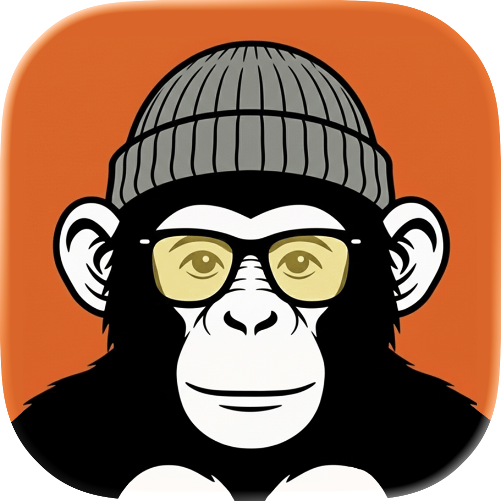

  

<h1 align="center">MonKey</h1>

  Keyboard autocorrection, translation, grammar checking & AI Wizard for macOS. 
  <a href="https://getmonkey.cc">getmonkey.cc</a>

  
  
  
  
  

---

## Structure

- `index.html` — Landing page
- `privacy.html` — Privacy Policy
- `security.html` — Security & Verification
- `terms.html` — Terms of Service
- `refund.html` — Refund Policy
- `appcast.xml` — Sparkle auto-update feed
- GitHub Releases — App binaries (.zip)
